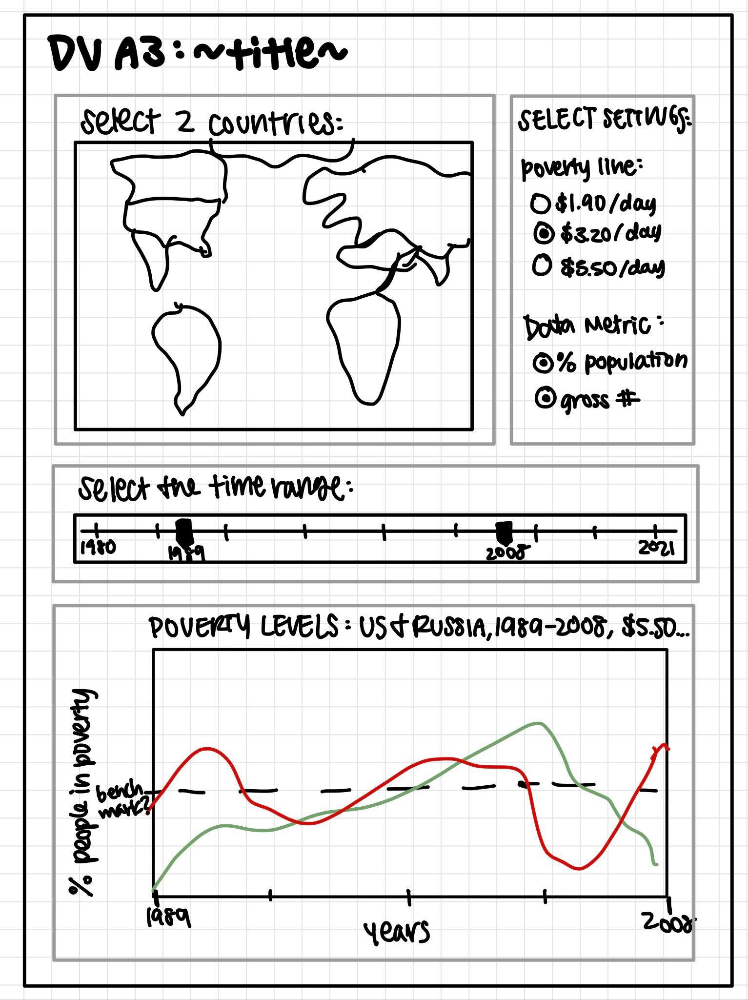

# Assignment 3 Writeup

## Assignment Goal

We aim to use D3 to visualize and understand the poverty conditions across the globe between 1977 and 2017.

## Description
We use the World Bank Indicators data (linked below) to access all the poverty indicators among all the countries. In the original dataset, there are more than 20 columns measuring various levels of poverty. In order to make a direct and easily understandable poverty comparisons. We chose the following three different criterias for poverty line.
1. $1.90 per day
2. $3.20 per day
3. $5.50 per day

We also allow the users to choose any two countries on the map, select the range of years they are interested in, and choose one of the three poverty metrics listed above to visualize the resulting graph.

## Rationale for the Design Decisions
To make all the clicking options easily distinguishable, we first provided the users a world map which can be clicked on. Once the users have chosen the two countries they want to compare, they can further choose the following options in a form format.

1. Poverty Line 
2. Range of Years 

Once all the selections are made, users can click the <b>
View Graph</b> button, and if the user input is valid, they will see a graph with the selected information at the bottom of the screen. The resulting graph will have two lines indicating the percentage of people in poverty of the two selected countries.

Before we began coding, we created a wireframe for the final dashboard.  
 

As you can see from the original design, we first chose to have a scroll bar which allows the users to choose the range of years. However, during the process of implentation, we realized it was more challenging to than we thought. Therefore, we made an alternative and provided users two dropdown lists to select the start year and the end year, and added input validation to ensure the end year is after the start year.

Another modification we made is the way the two countries are selected on the world map. Originally, we were thinking about allowing users to de-select a certain country. However, in order to simplify the process, we only allow the users to select the two distinct countries in one direction. If the user attempts to select a third country or two same countries, an alert will notify to notify the user such action is not allowed and the web page will be reloaded.

For the poverty metrics, we decided to use a drop down list with a default value set to $1.90/day instead of a set of radio buttons. Such modification is made to ensure the user does not forget to set it and conform with the selections of the start year and the end year. 

Lastly, we used Bootstrap and unique styling to make the whole dashboard more visually appealing. The world map will be on the left side of the web page and the selection page will be right next to the map. Once the user submits the selections, the resulting graph will show up below the world map.

## Development Process Overview

### Work Split Among the Memebers
Fernie and Emily first set up one in-person meeting to brainstorm all possible ideas. One initial idea was conducting a visualization of the crime rates in Chicago. However, we decided to switch to visualize the poverty conditions around the globe because it is more related to every one of us. We can actually understand and reflect how we have progressed as a whole unit throughout the years. 

- Fernie: 
1. Mainly focused on the development of the world map and worked on how to allow users to select the correct number of countries.
2. Participated in the research work of binding all pieces of information together and get the correct filtering result from the csv file.
3. Attended zoom meetings to discuss and share progress with Emily.
4. Drafted and modified this writeup.
5. Error checking the code.
6. Further polished the dashboard with stylesheets.

- Emily:
1. Developed the settings form and multi-line graph. 
2. Coded javascript functions and variables to communicate between user input and resulting graph. 
3. Hosted zoom meetings to discuss and share progress with Fernie.
4. Proofread and edit the writeup.
5. Error checking the code.
6. Further polished the dashboard with stylesheets.
7. Added the legends, labels, and title of the line chart.

### Hours Spent:
- Fernie: 15 hours
- Emily: 20 hours

### Most Time Consuming Part of the Assignment:
1. Finding the correct way of extracting the countries' names from the world map.
2. Creating a multi-line graph in D3 based on our csv data, especially debugging weird line behavior. 
3. Getting different user input pieces together to communicate with D3 and modify the graph accordingly.
4. General D3 implementation research for specific issues & varying versions. 